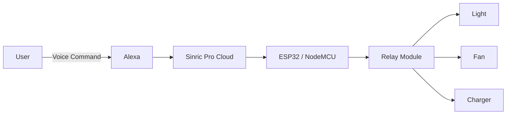

# 🏠 Smart Home Automation using ESP32, Alexa & Sinric Pro

<p align="center">


</p>

An **IoT-based Smart Home Automation System** that allows users to control household appliances using **Amazon Alexa voice commands** and the **Sinric Pro Cloud Platform**. The system uses an **ESP32/NodeMCU microcontroller** and **relay modules** to remotely switch electrical devices ON or OFF from anywhere with an internet connection.

---

## 📌 Features

* 🎙️ Voice control using Amazon Alexa
* 🌐 Remote appliance control through Wi-Fi
* ☁️ Cloud integration with Sinric Pro
* 💡 Control lights, fans, chargers, and other devices
* ⚡ Energy-efficient automation
* 🔒 Improves home convenience and security
* 📱 Real-time smart home management

---

## 🛠️ Technologies Used

| Technology      | Purpose              |
| --------------- | -------------------- |
| ESP32 / NodeMCU | Main Microcontroller |
| Arduino IDE     | Programming          |
| Amazon Alexa    | Voice Assistant      |
| Sinric Pro      | IoT Cloud Platform   |
| Relay Module    | Appliance Switching  |
| Wi-Fi           | Communication        |
| C++ (Arduino)   | Programming Language |

---

## 🏗️ System Architecture



---

## 🔄 Workflow

```text
User
   │
   ▼
Amazon Alexa
   │
   ▼
Sinric Pro Cloud
   │
   ▼
ESP32 / NodeMCU
   │
   ▼
Relay Module
   │
   ▼
Home Appliances
```

---

## 📷 Screenshots

> Add your project images inside the `images/` folder.

### Hardware Setup

```markdown

```

### Circuit Diagram

```markdown

```

### Project Demo

```markdown

```

---

## 📂 Project Structure

```text
Smart-Home-Automation/
│
├── README.md
├── code/
│   └── smart_home.ino
├── diagrams/
│   ├── architecture.md
│   ├── flowchart.md
│   ├── sequence.md
│   ├── usecase.md
│   └── class.md
├── images/
│   ├── setup.jpg
│   ├── circuit.png
│   └── demo.png
└── docs/
    └── Project_Report.pdf
```

---

## 🔌 Hardware Requirements

* ESP32 / NodeMCU
* 4-Channel Relay Module
* Breadboard
* Jumper Wires
* USB Cable
* Amazon Alexa Device
* Wi-Fi Connection
* Electrical Appliances

---

## 💻 Software Requirements

* Arduino IDE
* Sinric Pro Account
* Amazon Alexa App
* ESP32 Board Package
* Wi-Fi Network

---

## ⚙️ Installation & Setup

### 1. Clone the Repository

```bash
git clone https://github.com/your-username/Smart-Home-Automation.git
```

### 2. Open Arduino IDE

* Install ESP32 board support.
* Install the required libraries:

  * SinricPro
  * WiFi

### 3. Configure Credentials

Update the following in `smart_home.ino`:

```cpp
#define WIFI_SSID "Your_WiFi"
#define WIFI_PASS "Your_Password"

#define APP_KEY "Your_App_Key"
#define APP_SECRET "Your_App_Secret"
```

Also replace the device IDs with your Sinric Pro device IDs.

### 4. Upload Code

* Select the ESP32 board.
* Select the correct COM port.
* Click **Upload**.

### 5. Connect Alexa

* Open the Alexa App.
* Link your Sinric Pro account.
* Discover devices.
* Start controlling appliances using voice commands.

---

## 🎯 Example Voice Commands

* "Alexa, turn on the light."
* "Alexa, turn off the fan."
* "Alexa, switch on the charger."
* "Alexa, turn off all devices."

---

## 🚀 Future Enhancements

* AI-based automation
* Motion detection
* Smart scheduling
* Energy monitoring dashboard
* Mobile application
* Solar power integration
* Security sensors and alerts

---

## 📊 Benefits

* Remote access from anywhere
* Hands-free voice control
* Energy saving
* Cost-effective implementation
* Easy to expand with additional devices

---

## 👨‍💻 Author

**Disha Manje**

B.Sc. Computer Science Student
Passionate about IoT, Data Science, Machine Learning, and Cybersecurity.

---

## ⭐ Support

If you found this project useful, consider giving it a **⭐ Star** on GitHub and sharing it with others.

---

## 📄 License

This project is licensed under the MIT License.
