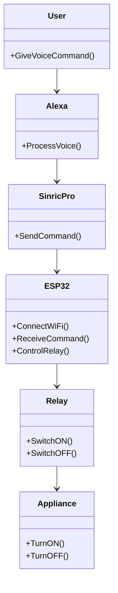

diagrams/class.md

# 📚 Class Diagram

```mermaid
classDiagram

class User{
    +GiveVoiceCommand()
}

class Alexa{
    +ProcessVoice()
}

class SinricPro{
    +SendCommand()
}

class ESP32{
    +ConnectWiFi()
    +ReceiveCommand()
    +ControlRelay()
}

class Relay{
    +SwitchON()
    +SwitchOFF()
}

class Appliance{
    +TurnON()
    +TurnOFF()
}

User --> Alexa
Alexa --> SinricPro
SinricPro --> ESP32
ESP32 --> Relay
Relay --> Appliance
```

## Description

The class diagram represents the relationship between the main components of the Smart Home Auto
