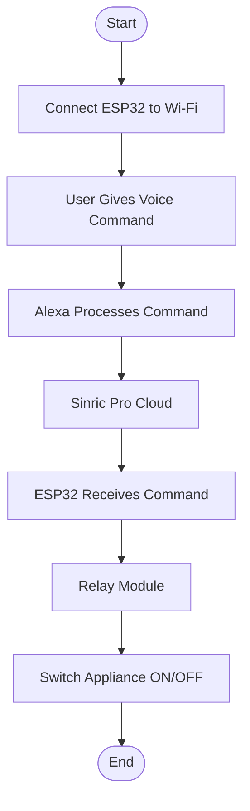

# 🔄 System Flowchart


```mermaid
flowchart TD

A([Start])
B[Connect ESP32 to Wi-Fi]
C[User Gives Voice Command]
D[Alexa Processes Command]
E[Sinric Pro Cloud]
F[ESP32 Receives Command]
G[Relay Module]
H[Switch Appliance ON/OFF]
I([End])

A --> B
B --> C
C --> D
D --> E
E --> F
F --> G
G --> H
H --> I
```

## Description

This flowchart illustrates how a voice command travels from the user to Alexa, through the cloud, and finally to the ESP32 to control the appliance.
````
