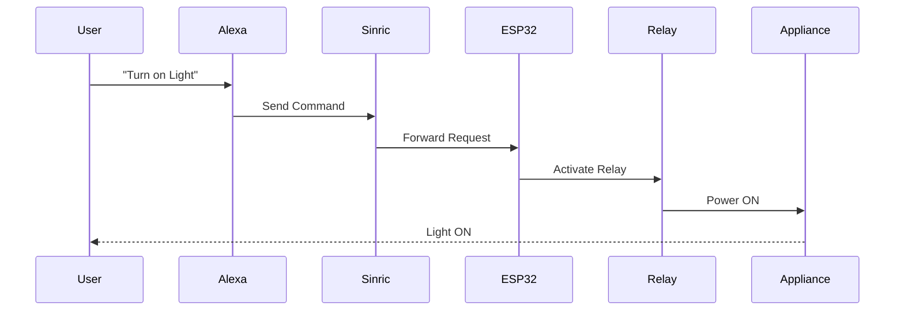

# 🔁 Sequence Diagram

```mermaid
sequenceDiagram
participant User
participant Alexa
participant Sinric
participant ESP32
participant Relay
participant Appliance
User->>Alexa: "Turn on Light"
Alexa->>Sinric: Send Command
Sinric->>ESP32: Forward Request
ESP32->>Relay: Activate Relay
Relay->>Appliance: Power ON
Appliance-->>User: Light ON
```
## Description 
Shows the sequence of interactions between the user, Alexa, cloud platform, ESP32, relay module, and appliance.
