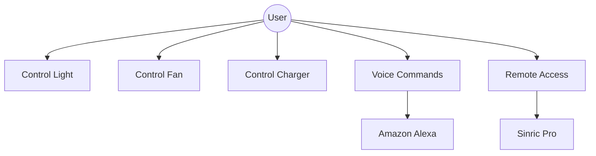

# 👥 Use Case Diagram

```mermaid
graph TD

User((User))

UC1[Control Light]
UC2[Control Fan]
UC3[Control Charger]
UC4[Voice Commands]
UC5[Remote Access]

User --> UC1
User --> UC2
User --> UC3
User --> UC4
User --> UC5

UC4 --> Alexa[Amazon Alexa]
UC5 --> Sinric[Sinric Pro]
```

## Description

The user can control different appliances using voice commands through Amazon Alexa and remotely manage devices using the Sinric Pro cloud platform.
